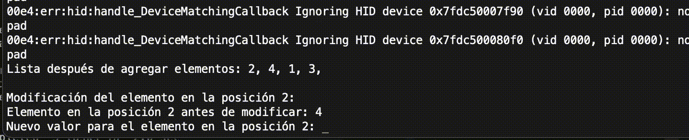
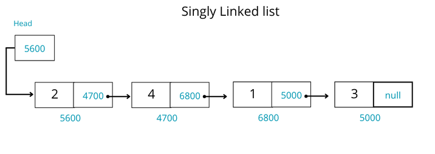

# Singly Linked List in C++ (Academic Project)

This academic project demonstrates the implementation of a **singly linked list** using object-oriented programming in C++. It includes basic operations like insertion, deletion, traversal, and search, providing hands-on experience with dynamic memory and pointer-based data structures.




## Description

The singly linked list is a dynamic data structure made up of nodes, where each node contains:

- A value
- A pointer to the next node

This project implements a menu-driven interface allowing users to:

- Insert elements at the beginning or end
- Delete elements from the beginning or end
- Search for a specific element
- Display all elements

Robust exception handling via custom exceptions (ListaVacia, FueraDeRango) is employed to handle errors.

## Compile and Run

```bash
clang++ -std=c++17 -Wall -o list main.cpp
./test
```

For Windows, yo can run the executable `singly_linked_list.exe`.

## Sample 

## Author

- Ana Laura Chenoweth Galaz
- Georgina Salcido Valenzuela

## License

This project is shared for academic and learning purposes under the MIT License.

